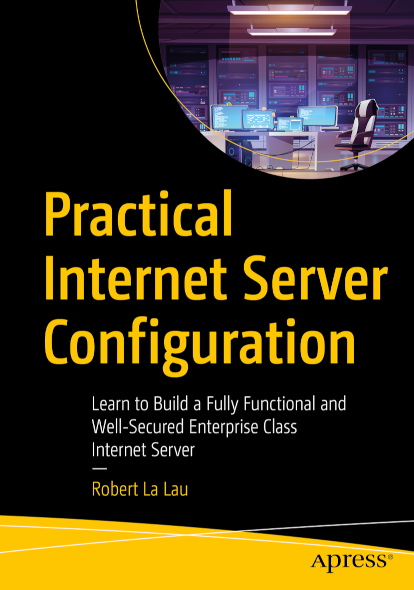

# Practical Internet Server Configuration

This repository accompanies *[Practical Internet Server Configuration](https://www.apress.com/book/9781484269596)* by Robert La Lau (Apress, 2021).

Download the files as a zip using the green button, or clone the repository to your machine using Git.

## Releases

[Release v1.0](https://github.com/Apress/practical-internet-server-configuration/releases/tag/v1.0) corresponds to the code in the published book, without corrections or updates.

## Contributions

See the file [Contributing.md](Contributing.md) for more information on how you can contribute to this repository.

## Errata

See the file [errata.md](errata.md) for corrections and additions discovered after the publication of the book.

## Addendum

An online addendum, containing a large number of links to additional information and documentation, is available at [librobert.net/book/internet/addendum](https://www.librobert.net/book/internet/addendum.en).

## About the book

Learn the skills to complete the full installation, configuration, and maintenance of an enterprise class internet server, no matter what Unix-like operating system you prefer. This book will rapidly guide you towards real system administration, with clear explanations along the way.

After a chapter explaining the most important Unix basics, you will start with a vanilla server as delivered by a hosting provider and by the end of the book, you will have a fully functional and well-secured enterprise class internet server. You will also be equipped with the expertise needed to keep your server secured and up to date.  All configuration examples are given for FreeBSD, Debian and CentOS, so you are free to choose your operating system.

No single blueprint exists for an internet server, and an important part of the work of a system administrator consists of analyzing, interpreting and implementing specific wishes, demands and restrictions from different departments and viewpoints within an organization. *Practical Internet Server Configuration* provides the information you need to succeed as a sysadmin.

### What You'll Learn

- Configure DNS using Bind 9
- Set up Apache and Nginx
- Customize a mail server: IMAP (Dovecot) and SMTP (Postfix), spam filtering included
- Authenticate mail users using LDAP
- Install and maintain MariaDB and PostgreSQL databases
- Prepare SSL/TLS certificates for the encryption of web, mail and LDAP traffic
- Synchronize files, calendars and address books between devices
- Build a firewall: PF for FreeBSD and nftables for Linux

### Who This Book Is For

This book can be used by aspiring and beginning system administrators who are working on personal servers, or more experienced system administrators who may know Unix well but need a reference book for the more specialized work that falls outside the daily routine. Basic understanding of Unix and working on the command line is necessary.

## More info

- [librobert.net](https://www.librobert.net/book/internet/index.en)
- [Apress](https://www.apress.com/book/9781484269596)
